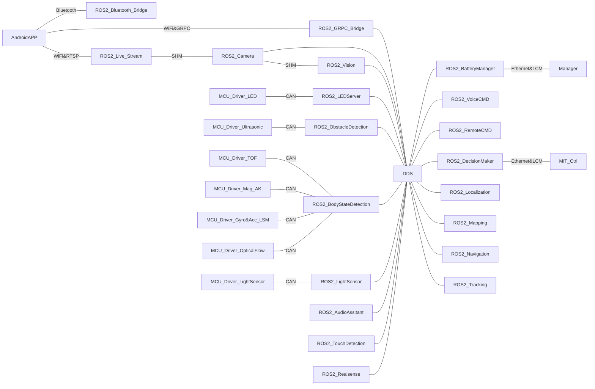

# Xiaomi CyberDog ROS 2(Athena)

[](https://choosealicense.com/licenses/apache-2.0/)
[](https://partner-gitlab.mioffice.cn/cyberdog/athena_cyberdog/-/commits/master)

> 该仓库目前已经迁移至 [cyberdog_ros2](https://github.com/MiRoboticsLab/cyberdog_ros2)，本仓库不再更新。

## 简介

本项目是铁蛋的ROS 2应用程序的主仓，支持单独构建和与其他辅仓库共同构建。辅仓库可参考[相关项目](#相关项目)了解更多。

## 软件架构

我们基于ROS 2实现了大部分的机器人应用，如架构图所示，包括多设备链接、多模态感知、多模态人机交互、自主决策、空间定位、导航和目标追踪等功能。目前使用的DDS中间件是`Cyclone DDS`，ROS 2的版本为`Foxy`。



由于NVIDIA对Jetson系列截至目前（202109）只提供了Ubuntu 18.04的支持，故我们对Ubuntu 18.04进行了ROS 2的适配和修改。具体的修改内容可以通过[ros2_fork/mini.repos](https://partner-gitlab.mioffice.cn/cyberdog/athena_repos/-/blob/master/ros2_fork/mini.repos)进行拉取，我们去除了部分没必要的仓，并添加了一些需要使用的仓库（文件是Galcatic版本的，我们会在后续适配到该版本）。

本项目的详细文档都在各个子模块的根目录里，如有需要可以直接点击进行了解：

- 通用类：
  - [athena_bringup](athena_bringup)：启动系统相关，我们在ROS 2的Launch启动系统上设计了更简约的启动项管理，对启动脚本（Python3）和启动内容进行了隔离。通过简单的参数配置，新的节点或新的进程便可被添加到启动项，而无需修改脚本内容。同时也支持参数管理、调试和开关等功能。
  - [athena_grpc](athena_common/athena_grpc)：机器人与外部通讯的媒介，目前与手机App进行连接是基于GRPC的。在未来将支持多机识别和多机通讯。
  - [athena_utils](athena_common/athena_utils)：本项目的通用功能仓，包括基于[cascade_lifecycle](https://github.com/fmrico/cascade_lifecycle)修改的LifecycleNode基类，和传感器相关节点共用的基类等。
  - [media_vendor](athena_common/media_vendor)：多媒体相关应用需要使用的`CMake`配置项。
  - [toml11_vendor](athena_common/toml11_vendor)：[toml11](https://github.com/ToruNiina/toml11)的桥接包。
- 感知类
  - [athena_bms](athena_ception/athena_bms)：CyberDog上的电池管理模块，主要负责电池信息的接收与分发。
  - [athena_body_state](athena_ception/athena_body_state)：该模块实现了整机运动状态的感知功能，并通过BodyState上报posequat和speed_vector两种message的数据（posequat表示整机姿态四元数；speed_vector表示整机运动的瞬时速度，单位：m/s）。
  - [athena_lightsensor](athena_ception/athena_lightsensor)：该模块创建了机器人感知系统中Light Sensor的service和publisher，当机器人需要感知周围环境光的强度时，可通过上层决策层启动该service和publisher，获取环境光照度信息。
  - [athena_obstacledetection](athena_ception/athena_obstacledetection)：该模块创建了机器人感知系统中Ultrasonic Sensor的service和publisher。
  - [athena_scenedetection](athena_ception/athena_scenedetection)：该模块为机器人提供场景检测功能，通过定位芯片获取当前位置信息，同时通过卫星信号质量判断机器人当前处于室内或室外。
 
- 交互类：
  - [athena_audio](athena_interaction/athena_audio)
    - [audio_base](athena_interaction/athena_audio/audio_base)：该模块用于播放多段或单段不定长PCM音频数据、wav格式音频文件，其底层实现为SDL2与SDL_mixer。
    - [audio_interaction](athena_interaction/athena_audio/audio_interaction)：该模块用于实现整个音频模块的交互部分，主要包括与其它模块之间关于通用播放的交互、语音助手相关控制与交互功能和与APP(grpc)之间关于音量调解的交互功能。
  - [athena_camera](athena_interaction/athena_camera)：该模块基于NVIDIA Argus和ROS 2实现了相机的基础功能，包括拍照和录像等，并为其他模块（视觉SDK、图传等）提供调用接口。
  - [athena_led](athena_interaction/athena_led)：该模块用于统一决策系统所有的LED灯效请求，基于ROS2 Service以及sensor_utils类实现，通过定义不同client的LED消息优先级以及timeout来实现对CyberDog头灯和尾灯的控制显示功能。
  - [athena_livestream](athena_interaction/athena_livestream)
  - [athena_touch](athena_interaction/athena_touch)：该模块提供了topic为TouchState的publisher, 继承于athena_utils::LifecycleNode. 目前支持单指单击报LPWG_SINGLETAP_DETECTED 和单指长按3s报LPWG_TOUCHANDHOLD_DETECTED事件。
  - [athena_wireless](athena_interaction/athena_wireless)
    - [bluetooth](athena_interaction/athena_wireless/bluetooth)：该模块实现了：注册蓝牙GATT service，发送BLE广播，等待手机APP连接成功后，接收APP发送的Wifi信息，实现Wifi的联网操作，并返回联网结果，以及通过APP提供的命令，实现蓝牙手柄的扫描，连接，达到通过手柄控制CyberDog的目的。
    - [wifirssi](athena_interaction/athena_wireless/wifirssi)：该模块的主要功能是创建定时任务，实时查询当前已连接Wifi的信号强度，并通过ros2的topic通讯进行传输。
- 决策类：
  - [athena_decisionmaker](athena_decision/athena_decisionmaker)：面向业务层，负责实现具体业务功能。目前提供了`automation_manager`、`ception_manager`、`interaction_manager`和`motion_manager`。分别用于自动化功能、感知功能、人机交互功能和运动功能的管理和决策。该四个模块均继承`cascade_manager`，并在基础上根据业务功能稍作改动。
  - [athena_decisionutils](athena_decision/athena_decisionutils)：决策相关功能的基类和工具类集合，负责实现通用功能。目前提供了`cascade_manager`，该模块继承于`athena_utils::LifecycleNode`，具备级联/并联和单点控制的功能，可以快速管控其作用域下的节点的启动和关闭。
- 接口类：
  - [athena_interfaces](athena_interfaces/athena_interfaces)：接口总抽象包。
  - [automation_msgs](athena_interfaces/automation_msgs)：自动化功能相关接口。
  - [cascade_lifecycle_msgs](athena_interfaces/cascade_lifecycle_msgs)：级联节点相关接口。
  - [ception_msgs](athena_interfaces/ception_msgs)：感知功能相关接口。
  - [interaction_msgs](athena_interfaces/interaction_msgs)：交互功能相关接口。
  - [motion_msgs](athena_interfaces/motion_msgs)：运动功能相关接口。

## 前置条件

如在交叉环境进行编译，可参考[交叉编译铁蛋源码](TBD)进行了解环境的配置。

如在目标设备上直接编译，需要保证已连接互联网。首选环境是铁蛋，次选环境是`NVIDIA Jetson系列`的开发环境。

如是后者，需要保证安装：

- ROS 2（Foxy）：最小必须。并且需要至少包含[mini.repos](https://partner-gitlab.mioffice.cn/cyberdog/athena_repos/-/blob/master/ros2_fork/mini.repos)中的功能包。
- LCM：最小必须。可通过下载源码编译安装。
- mpg123,SDL2和SDL2_Mixer：基础必须。最好通过源码安装，并确保按照前面所写的顺序编译安装。
- NV相关库：基础必须。可`nvidia-l4t-jetson-multimedia-api`和`cuda-compiler-10-2`。
- OpenCV、VTK、PCL和相关的ROS 2桥接包等，参考[extend.repos](https://partner-gitlab.mioffice.cn/cyberdog/athena_repos/-/blob/master/ros2_fork/extend.repos)和[custom.repos](https://partner-gitlab.mioffice.cn/cyberdog/athena_repos/-/blob/master/ros2_fork/custom.repos)

## 构建 & 部署

本项目支持三种构建策略：

1. 最小功能包：只编译影响整机启动和运动的相关功能包。
2. +=基础功能包：编译本仓（athena_cyberdog）的全部功能包。
3. +=扩展功能包：编译本仓与相关扩展仓的全部功能包。

### 最小功能包的构建

编译方法：

1. 下载`athena_cyberdog`和`athena_lcm_type`。

```
$ mkdir -p ros_apps/src
$ cd ros_apps/src
$ git clone https://partner-gitlab.mioffice.cn/cyberdog/athena_cyberdog.git
$ git clone https://partner-gitlab.mioffice.cn/cyberdog/athena_lcm_type.git
$ cd ..
```

2. 使用`--packages-up-to`编译（[确保source过ROS 2的环境变量](TBD)）

```
$ colcon build --merge-install --packages-up-to athena_bringup
```

或者，编译到指定目录，注意：如有需要请替换`/opt/ros2/cyberdog`的值为其他。

```
$ export OUTPUT_DIR=/opt/ros2/cyberdog
$ colcon build --merge-install --install-base $OUTPUT_DIR --packages-up-to athena_bringup
```

### +=基础功能包

编译方法：

1. 下载`athena_cyberdog`和`athena_lcm_type`。

```
$ mkdir -p ros_apps/src
$ cd ros_apps/src
$ git clone https://partner-gitlab.mioffice.cn/cyberdog/athena_cyberdog.git
$ git clone https://partner-gitlab.mioffice.cn/cyberdog/athena_lcm_type.git
$ cd ..
```

2. 直接编译所有的包（[确保source过ROS 2的环境变量](TBD)）

```
$ colcon build --merge-install
```

或者，编译到指定目录，注意：如有需要请替换`/opt/ros2/cyberdog`的值为其他。

```
$ export OUTPUT_DIR=/opt/ros2/cyberdog
$ colcon build --merge-install --install-base $OUTPUT_DIR
```

### +=扩展功能包

1. 下载`athena_cyberdog`、`athena_lcm_type`、`athena_assitant`、`athena_automation`和`athena_vision`。

```
$ mkdir -p ros_apps/src
$ cd ros_apps/src
$ git clone https://partner-gitlab.mioffice.cn/cyberdog/athena_cyberdog.git
$ git clone https://partner-gitlab.mioffice.cn/cyberdog/athena_lcm_type.git
$ git clone https://partner-gitlab.mioffice.cn/cyberdog/athena_assistant.git
$ git clone https://partner-gitlab.mioffice.cn/cyberdog/athena_automation.git
$ git clone https://partner-gitlab.mioffice.cn/cyberdog/athena_vision.git
$ cd ..
```

2. 直接编译所有的包（[确保source过ROS 2的环境变量](TBD)）

```
$ colcon build --merge-install
```

或者，编译到指定目录，注意：如有需要请替换`/opt/ros2/cyberdog`的值为其他。

```
$ export OUTPUT_DIR=/opt/ros2/cyberdog
$ colcon build --merge-install --install-base $OUTPUT_DIR
```

### 通用的部署方式

如果使用的是`/opt/ros2/cyberdog`路径进行编译，且环境是铁蛋，重启机器或服务即可部署完毕。

重启服务的方式：

```
$ sudo systemctl restart cyberdog_ros2.service
```

补充：如果编译了`扩展功能包`，还需要执行

```
$ sudo systemctl restart cyberdog_automation.service
```

## 相关项目

- [语音助手](https://partner-gitlab.mioffice.cn/cyberdog/athena_assistant)：基于小米小爱同学的语音助手的ROS 2桥接包。
- [视觉检测&识别](https://partner-gitlab.mioffice.cn/cyberdog/athena_vision)：基于小米AI计算机视觉的人脸、手势和人体检测和识别的ROS 2桥接包。
- [定位&导航&跟踪](https://partner-gitlab.mioffice.cn/cyberdog/athena_automation)：基于ROS 2的自动化功能包，包括定位、导航和跟踪等功能包。

## 相关资源

- [CyberDogAPP下载链接](http://cdn.cnbj1.fds.api.mi-img.com/ota-packages/apk/cyberdog_app.apk)
- [铁蛋躯干Step文件](https://cdn.cnbj2m.fds.api.mi-img.com/cyberdog-package/packages/doc_materials/cyber_dog_body.stp)

## 向铁蛋贡献力量！

浏览页面[CONTRIBUTING.md](CONTRIBUTING.md)了解如何向铁蛋贡献力量！
