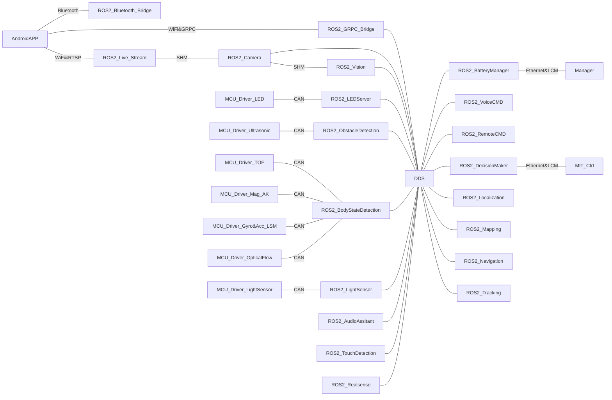

# Xiaomi CyberDog ROS 2(Athena)

[](https://choosealicense.com/licenses/apache-2.0/)
[](https://partner-gitlab.mioffice.cn/cyberdog/athena_cyberdog/-/commits/master)

## Introduction

This repository contains the Cyberdog project based on ROS 2. It supports independent construction and co-construction with other Extended dependencies. For more information about the dependencies, please look at [Related projects](#related-projects).

## Software Architecture 

Most of the robot applications are implemented based on ROS 2. As shown in the framework diagram, it includes functions such as multi-device connection, multi-modal perception, multi-modal human-computer interaction, autonomous decision-making, localization, navigation, and target tracking. Currently, the DDS middleware in use is `Cyclone DDS`, and the ROS 2 Package is implemented at `ROS2-Foxy`.



Due to NVIDIA only provides support for Ubuntu 18.04 for the Jetson series (202109) as yet, we have adapted and modified ROS 2 for Ubuntu 18.04. The specific modification content can be pulled through [ros2_fork/mini.repos](https://partner-gitlab.mioffice.cn/cyberdog/athena_repos/-/blob/master/ros2_fork/mini.repos). We have removed some unnecessary repositories, and added some repositories that need to be used (The file is of the Galactic version, and we will adapt to this version in the future).

The documentation of this project is in the root directory of each submodule. If necessary, feel free to read the README files.

- Common:
  -  [athena_bringup](athena_bringup): Startup program. We designed simpler management on the ROS 2 Launch system and isolated the startup script (Python3) and startup content. Through simple parameter configuration, new nodes or processes can be added to the startup item without modifying the script content. It also supports functions such as parameter management, debugging and switching, etc.
  - [athena_grpc](athena_common/athena_grpc): The communication agent between the robot and the real world. Currently, the connection with the mobile app is based on GRPC. In the future, it will support multi-device identification and multi-device communication.
  - [athena_utils](athena_common/athena_utils): The general function repository of this project. It contains the base class of LifecycleNode[cascade_lifecycle](https://github.com/fmrico/cascade_lifecycle) and the base class shared with sensor-related nodes, etc.
  - [media_vendor](athena_common/media_vendor): The `CMake` configuration items that multimedia related applications need to use.
  - [toml11_vendor](athena_common/toml11_vendor): Bridge package of [toml11](https://github.com/ToruNiina/toml11).
- Perception:
  - [athena_bms](athena_ception/athena_bms): The battery management module on CyberDog. It is mainly responsible for receiving and distributing battery information.
  - [athena_body_state](athena_ception/athena_body_state): This module realizes the perception function of the whole machine motion state, and reports the data of posequat and speed_vector through BodyState (posequat represents the posture quaternion of the robot; speed_vector represents the instantaneous speed of the robot motion, unit: m/s).
  - [athena_lightsensor](athena_ception/athena_lightsensor): This module creates the service and publisher of the Light Sensor in the robot perception system. When the robot needs to perceive the intensity of the ambient light, it can start the service and publisher through the upper decision making layer to obtain the ambient light information.
  - [athena_obstacledetection](athena_ception/athena_obstacledetection): This module creates the service and publisher of Ultrasonic Sensor in the robot perception system.
  - [athena_scenedetection](athena_ception/athena_scenedetection): This module provides a scene detection function for the robot. Obtain the current position information through the position chip. Determine whether the robot is currently indoors or outdoors based on the quality of the satellite signal.
  
- Interaction:
  - [athena_audio](athena_interaction/athena_audio)
    - [audio_base](athena_interaction/athena_audio/audio_base): This module is used to play multi-segment or single-segment variable length PCM audio data,  audio files with wav format. Its bottom layer is implemented as SDL2 and SDL_mixer.
    - [audio_interaction](athena_interaction/athena_audio/audio_interaction): This module is used to implement the interactive part of the audio module, which mainly includes the interaction with other modules on common playback, the control and interaction functions of the voice assistant, and the interaction function with APP (grpc) about volume adjustment.
  - [athena_camera](athena_interaction/athena_camera): This module implements the basic functions of the camera based on NVIDIA Argus and ROS 2, including taking pictures and videos, and provides a calling interface for other modules (visual SDK, image transmission, etc.).
  - [athena_led](athena_interaction/athena_led): This module is used to unify all the LED lighting requests of the decision-making system. It is based on ROS2 Service and sensor_utils. It realizes the control and display function of CyberDog headlights and taillights by defining the LED message priority and timeout of different clients.
  - [athena_livestream](athena_interaction/athena_livestream)
  - [athena_touch](athena_interaction/athena_touch): This module provides a publisher of topic TouchState, and is a subclass of  athena_utils::LifecycleNode. Currently, it supports to report LPWG_SINGLETAP_DETECTED event with a single finger to single-click and report LPWG_TOUCHANDHOLD_DETECTED event with a single finger to hold for 3 seconds.
  - [athena_wireless](athena_interaction/athena_wireless)
    - [bluetooth](athena_interaction/athena_wireless/bluetooth): The module realizes: register Bluetooth GATT service; send BLE broadcast; after waiting for the mobile APP to connect successfully, receive the Wifi information sent by the APP; realize the Wifi networking operation; return the networking results; realize the Bluetooth handle through the commands provided by the APP Scan and connect. Achieve the purpose of controlling CyberDog through the handle.
    - [wifirssi](athena_interaction/athena_wireless/wifirssi): The main function of this module is to create a timed task, query the signal strength of the currently connected Wifi in real time, and transmit it through the topic of ros2.
- Decision:
  - [athena_decisionmaker](athena_decision/athena_decisionmaker): Towards business layer, responsible for realizing specific business functions. Currently it provides `automation_manager`, `ception_manager`, `interaction_manager` and `motion_manager`, respectively used for automation functions, perception functions, human-computer interaction functions, management and decision making of motion functions. These four modules all are subclasses of the `cascade_manager` and make slight changes based on the business functions.
  - [athena_decisionutils](athena_decision/athena_decisionutils): A collection of base classes and tool classes for decision making, responsible for implementing general functions. Currently, it provides `cascade_manager`, which inherits from `athena_utils::LifecycleNode` and has the functions of cascade/parallel connection and single point of control. It can control the startup and shutdown of nodes under its scope quickly.
- Interface:
  - [athena_interfaces](athena_interfaces/athena_interfaces): Interfaces total abstract package.
  - [automation_msgs](athena_interfaces/automation_msgs): Interfaces related to automation functions.
  - [cascade_lifecycle_msgs](athena_interfaces/cascade_lifecycle_msgs): Interfaces of cascading nodes.
  - [ception_msgs](athena_interfaces/ception_msgs): Interfaces related to perception function.
  - [interaction_msgs](athena_interfaces/interaction_msgs): Interfaces related to interactive functions.
  - [motion_msgs](athena_interfaces/motion_msgs): Interfaces related to motion functions.

## Precondition

If you are compiling in a cross environment, you can refer to [Cross Compiling CyberDog Source Code] (TBD) to understand the environment configuration.

If you are directly compiling on the target device, you need to ensure that you have connected to the Internet. The preferred environment is CyberDog, and the second choice is the development environment of the `NVIDIA Jetson series`.

If the latter, you need to ensure the following packages are installed:

-ROS 2 (Foxy): Required for construction of minimal package. And it needs to contain at least the package [mini.repos](https://partner-gitlab.mioffice.cn/cyberdog/athena_repos/-/blob/master/ros2_fork/mini.repos).
-LCM: Required for construction of minimal package. It can be compiled and installed by downloading the source code.
-mpg123, SDL2 and SDL2_Mixer: Required for construction of other package. It is best to install through source code and make sure to compile and install in the order written above.
-NV-related libraries: Required for construction of other package.. You can use `nvidia-l4t-jetson-multimedia-api` and `cuda-compiler-10-2`.
- OpenCV、VTK、PCL and bridge package of ROS 2, etc.: Refer to [extend.repos](https://partner-gitlab.mioffice.cn/cyberdog/athena_repos/-/blob/master/ros2_fork/extend.repos) and [custom.repos](https://partner-gitlab.mioffice.cn/cyberdog/athena_repos/-/blob/master/ros2_fork/custom.repos).

## Build & Deploy

This project supports three construction strategies:

1. Minimal package: Only compile the relevant packages that affect the startup and motion of the whole machine.
2. +=Basic package: Compile all packages of this repository(athena_cyberdog).
3. +=Extended package: Compile all packages of this repository and related expansion repository.

### Construction of Minimal Package

Compilation process:

1. Download `athena_cyberdog` and `athena_lcm_type`.

```
$ mkdir -p ros_apps/src
$ cd ros_apps/src
$ git clone https://partner-gitlab.mioffice.cn/cyberdog/athena_cyberdog.git
$ git clone https://partner-gitlab.mioffice.cn/cyberdog/athena_lcm_type.git
$ cd ..
```

2. Use `--packages-up-to` to compile（[Ensure the ROS 2 environment is sourced](TBD)）

```
$ colcon build --merge-install --packages-up-to athena_bringup
```

Or, compile to the specified directory. Note: If necessary, please replace `/opt/ros2/cyberdog` with your path.

```
$ export OUTPUT_DIR=/opt/ros2/cyberdog
$ colcon build --merge-install --install-base $OUTPUT_DIR --packages-up-to athena_bringup
```

### +=Basic package

Compilation process:

1. Download `athena_cyberdog` and `athena_lcm_type`.

```
$ mkdir -p ros_apps/src
$ cd ros_apps/src
$ git clone https://partner-gitlab.mioffice.cn/cyberdog/athena_cyberdog.git
$ git clone https://partner-gitlab.mioffice.cn/cyberdog/athena_lcm_type.git
$ cd ..
```

2. Compile all packages ([Ensure the ROS 2 environment is sourced](TBD))

```
$ colcon build --merge-install
```

Or, compile to the specified directory. Note: If necessary, please replace `/opt/ros2/cyberdog` with your path.

```
$ export OUTPUT_DIR=/opt/ros2/cyberdog
$ colcon build --merge-install --install-base $OUTPUT_DIR
```

### +=Extended package

1. Download `athena_cyberdog`、`athena_lcm_type`、`athena_assitant`、`athena_automation` and `athena_vision`.

```
$ mkdir -p ros_apps/src
$ cd ros_apps/src
$ git clone https://partner-gitlab.mioffice.cn/cyberdog/athena_cyberdog.git
$ git clone https://partner-gitlab.mioffice.cn/cyberdog/athena_lcm_type.git
$ git clone https://partner-gitlab.mioffice.cn/cyberdog/athena_assistant.git
$ git clone https://partner-gitlab.mioffice.cn/cyberdog/athena_automation.git
$ git clone https://partner-gitlab.mioffice.cn/cyberdog/athena_vision.git
$ cd ..
```

2. Compile all packages ([Ensure the ROS 2 environment is sourced](TBD))

```
$ colcon build --merge-install
```

Or, compile to the specified directory. Note: If necessary, please replace `/opt/ros2/cyberdog` with your path.

```
$ export OUTPUT_DIR=/opt/ros2/cyberdog
$ colcon build --merge-install --install-base $OUTPUT_DIR
```

### General deployment method

If you use the `/opt/ros2/cyberdog` path to compile and the environment is cyberdog, restart the machine or service to complete the deployment.

To restart the service:

```
$ sudo systemctl restart cyberdog_ros2.service
```

Note: If the `Extended Package` is compiled, you still need to execute the following command:

```
$ sudo systemctl restart cyberdog_automation.service
```

## Related Projects

-[Voice Assistant](https://partner-gitlab.mioffice.cn/cyberdog/athena_assistant): ROS 2 bridge package based on Xiaomi Xiaoai’s voice assistant.
-[Visual Inspection & Recognition](https://partner-gitlab.mioffice.cn/cyberdog/athena_vision): ROS 2 bridge package for face, gesture and human body detection and recognition based on Xiaomi AI computer vision.
-[Localization& Navigation & Tracking] (https://partner-gitlab.mioffice.cn/cyberdog/athena_automation): ROS 2 based automation package, including localization, navigation and tracking, etc.

## Related Resources

- [CyberDogAPP download link](http://cdn.cnbj1.fds.api.mi-img.com/ota-packages/apk/cyberdog_app.apk)
- [Step file of CyberDog body](https://cdn.cnbj2m.fds.api.mi-img.com/cyberdog-package/packages/doc_materials/cyber_dog_body.stp)

## Contribute to CyberDog!

Go through the page [CONTRIBUTING.md](CONTRIBUTING.md) to learn how to contribute to CyberDog!
